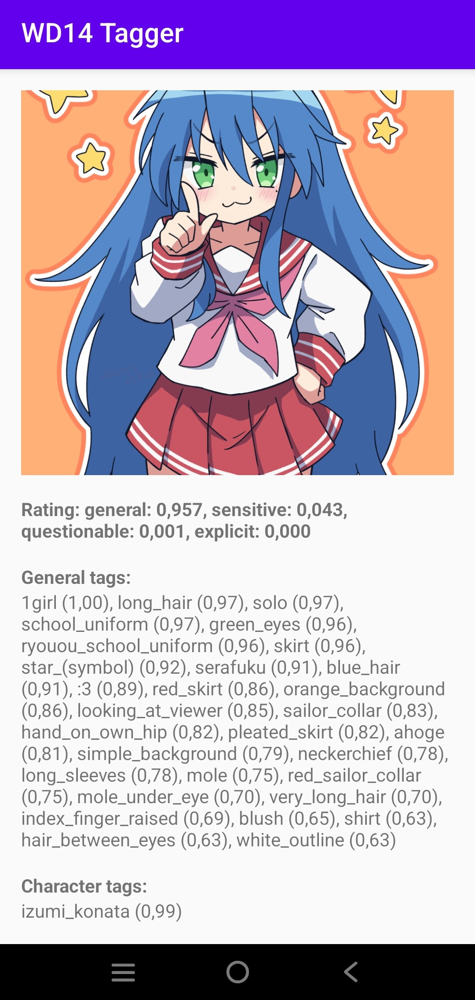

MVP приложение для инференса моделей WD Tagger на Android-устройствах

Тестировалось на модели https://huggingface.co/SmilingWolf/wd-swinv2-tagger-v3/tree/main

Загружает onnx и csv модели из любой папки внешнего хранилища (первую строку csv - tag_id,name,category,count может потребоваться удалить)

 

(Картинка с Конатой - danbooru ID: 11212584)

Для batch-режима используется долгий тап по кнопке. 

Полученный db.json по структуре идентичен тому что генерирует Automatic1111 WebUI
